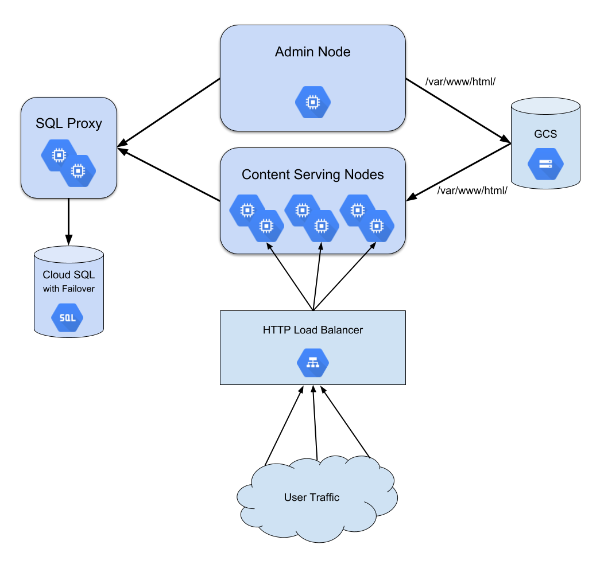
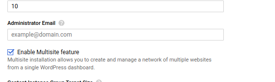

# WordPress High Availability Getting Started Guide

## Overview

This document aims to provide the information necessary to maintain and perform
administrative tasks on your WordPress High Availability deployment from the
[Google Cloud Platform Marketplace](https://cloud.google.com/marketplace/).

## Prerequisites

This solution leverages a few GCP features, which require certain APIs to be
enabled in your project in order for
[Deployment Manager](https://cloud.google.com/deployment-manager/) to
successfully deploy these resources. The following APIs should be enabled
**before** you deploy the solution:

*   [Google Identity and Access Management (IAM) API](https://console.developers.google.com/apis/api/iam.googleapis.com/overview)
*   [Cloud SQL Administration API](https://console.developers.google.com/apis/api/sqladmin.googleapis.com/overview)
*   [Cloud Container Builder API](https://console.developers.google.com/apis/api/cloudbuild.googleapis.com/overview)

The Google Identity and Access Management (IAM) API is required in order to
create a service account who only has access to the GCS bucket that will also be
created as part of the deployment.

The Cloud SQL Administration API is required in order to create and interact
with the Cloud SQL instances that are created as part of the deployment.

The Cloud Container Builder API is required in order to delete the GCS bucket
and its contents at deployment deletion time.

## Architecture

The solution architecture is made up of 5 main components:

1.  A [Google Cloud SQL](https://cloud.google.com/sql/) instance running MySQL
    configured with failover to handle database workloads
1.  A [Google Cloud Storage](https://cloud.google.com/storage/) bucket to act as
    a synchronization point for content stored in `/var/www/html/`
1.  A
    [Managed Instance Group](https://cloud.google.com/compute/docs/instance-groups/)
    for running Cloud SQL proxy tool, responsible for maintaining secure and
    efficient database connections
1.  A
    [Managed Instance Group](https://cloud.google.com/compute/docs/instance-groups/)
    for the VM that will be used to perform administrative functions in
    WordPress
1.  A
    [Managed Instance Group](https://cloud.google.com/compute/docs/instance-groups/)
    for the VMs that will serve the content of your blog
1.  An [HTTP Load Balancer](https://cloud.google.com/load-balancing/) to
    distribute the traffic between the content serving nodes

### Architecture Diagram



## Key Components & Services

There are two custom services running on the deployed machines that are
essential for the solution to function properly. These services are **gcs-sync**
(running on WordPress instances - both Admin and Content) and **cloudsql-proxy**
(running on the SQL Proxy instances).

The **gcs-sync** service runs a script `/opt/c2d/downloads/gcs-sync` that,
depending on the role the VM is assigned (Content or Admin), will check in with
the GCS bucket tied to the deployment and determine if content needs to be
pushed to or pulled from GCS. If you need to interact with the service, you can
do so via `systemctl`.

For example, the following command will kill the script checking GCS, and the node will not receive
any updates that come from the Administrator Node:

```shell
systemctl stop gcs-sync
```

Conversely, if the service needs to be started you can do so with the following command:

```shell
systemctl start gcs-sync
```

The **cloudsql-proxy** service makes use of the
[Cloud SQL Proxy](https://cloud.google.com/sql/docs/mysql/sql-proxy) binary so
you can connect to your Cloud SQL instance without having to whitelist IP
addresses, which can change when instances are deleted and recreated in a
Managed Instance Group. The Cloud SQL binary is located at
`/opt/c2d/downloads/cloud_sql_proxy` and the script that executes the binary is
located at `/opt/c2d/downloads/cloudsql-proxy`.

As with the service that runs **gcs-sync**, it can be interacted with using `systemctl`.
You can stop the service by running:

```shell
systemctl stop cloudsql-proxy
```

At this point your instance will not be able to communicate with the Cloud SQL instance, and the
application will not function.

If you needed to manually start the service for any reason, you can do so with the following command:

```shell
systemctl start cloudsql-proxy
```

## WordPress High Availability with Multisite feature enabled

You can also install WordPress HA with Multisite feature enabled like in screenshot below.



When Multisite feature is enabled with installation of WordPress HA, it will add `define('WP_ALLOW_MULTISITE', true);` to `wp-config.php`
and will disable all plugins to enable installing of network for Multisite sites.

To complete installation please visit [Create a Network for sites](https://wordpress.org/support/article/create-a-network/#step-3-installing-a-network) and continue from Step 3.
